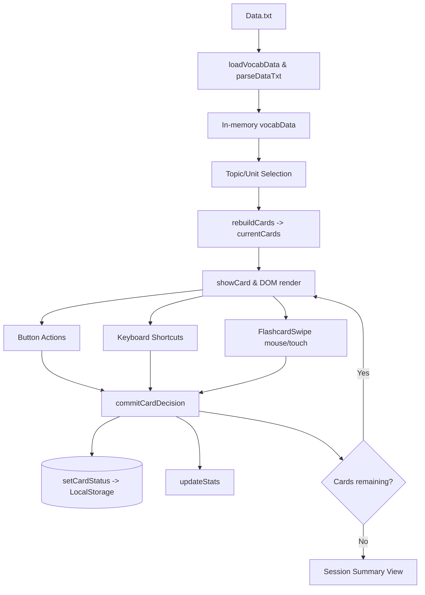

# Japanese Flashcard — Technical Project Documentation

## 1) Project Overview

### Project Name

- Japanese Flashcard

### Purpose

- A browser-based Japanese vocabulary learning application that lets users:
  - Choose units and topics to study.
  - Review vocabulary flashcards (front/back).
  - Mark memory confidence (Remembered / Forgot).
  - Track learning progress and persist state locally.

### Target Users

- Learners studying Japanese vocabulary by units and topics.
- Self-study users who need lightweight, frictionless progress tracking without creating an account or logging in.

### Main Features (Implemented)

- Unit/topic filtering and dynamic card set rebuilding.
- Flashcard front/back flip interaction.
- Manual navigation (Prev/Next), shuffle, and random mode toggles.
- Swipe-based decision flow (Tinder/Anki style) supporting both mouse (desktop) and touch (mobile) with animated dismissal.
- Per-card learning status persistence via LocalStorage.
- Session completion summary (total cards, remembered, forgot).
- Aggregate statistics panel for selected topics.

---

## 2) Tech Stack

### Frontend

- **Languages/Frameworks:** Vanilla HTML, CSS, and JavaScript (No React, Vue, or Angular).
- **Styling:** Custom CSS (`style.css`), utilizing CSS Grid/Flexbox and responsive media queries.

### Backend & Database (Persistence)

- **Backend:** None (Static site architecture).
- **Database/Storage:** Browser `LocalStorage` (`jp_flashcard_progress`) manages the persistence.

### Data Source

- Static text file `Data.txt`, fetched via `fetch` API and parsed at runtime.

---

## 3) Folder & File Structure

The workspace utilizes a modular structure:

- `index.html` — App shell, semantic sections, structural containers, modal settings, and controls.
- `style.css` — Global styles, layout, button system, flashcard visuals, swipe overlays, responsive tuning, and the **Theming System** (CSS variables).
- `src/app.js` — Main application orchestration: data loading, state management, event handling, and session flow.
- `src/ui/renderers.js` — DOM manipulation, rendering cards, progress bars, and stats.
- `src/features/swipe/useSwipe.js` — Reusable swipe interaction handling mouse/touch gestures and calculation of swipe thresholds and animations.
- `Data.txt` — Vocabulary content grouped by unit/topic using a specific delimiter-based format.
- `.nojekyll` — Static-hosting compatibility marker.

---

## 4) Core Feature Breakdown

### Theming System
- 11 distinct themes categorized into Base, Vibe, and Cultural (e.g., Sakura Bloom, Cyberpunk, Studio Ghibli).
- Driven entirely by CSS Variables (`--bg-color`, `--primary`, etc.) linked to `data-theme` on the body.
- Dynamic keyframe animations (like falling sakura petals) natively handled in CSS for advanced cultural themes.
- Theme preference is persisted in LocalStorage.

### AI Features (Contextual Assistants)
- **Xem ví dụ (Examples)** & **Memory Master (Mnemonics)** integration buttons.
- State-aware toggling: UI intelligently disabled via `.disabled` class when AI is turned off without hiding elements.

### Progress & Session Management (Fixed)
- Dynamic denominator fix in session: ensures total card count in the session remains stable while the current card increments securely.

### Flashcard Display

- Each card has a front panel (`kanji`, `kana`) and a back panel (`romaji`, `meaning`).
- Rendering is handled by the `showCard()` function in `script.js`.
- Status pills (`New`, `Remembered`, `Forgot`) are dynamically injected by `updateCardBadge()`.

### Flip Interaction

- `flipCard()` toggles the `flipped` CSS class, applying a `rotateY(180deg)` transition.
- Triggered by clicking the "Flip" button, pressing the `Spacebar`, or a fallback card tap from the swipe module.

### Navigation

- `nextCard()` and `prevCard()` cycle the current index within the active in-memory deck.
- `shuffleCards()` and `toggleMode()` randomize the current deck order.

### Learning Flow

- The deck is assembled depending on the active unit/topic via `rebuildCards()`.
- Users make decisions via buttons (`markCard()`) or swiping (`commitCardDecision()`).
- After a decision, the card is removed from the active session deck.
- Once the deck is empty, a summary panel is displayed via `showSummary()`.

### Scoring & Progress

- Aggregate stats over selected topics track: Total cards, Remembered count, Forgot count, and overall progress percentage.
- This is computed dynamically in `updateStats()` using LocalStorage data.

---

## 5) Swipe Feature Implementation

### Structure

- Encapsulated within the `FlashcardSwipe` class in `flashcardSwipe.js`.
- Instantiated globally via `setupSwipeController()` in `script.js`.

### Event Handling

- **Desktop:** Binds `mousedown` on the card container, and `mousemove`/`mouseup` on the `window` during a drag operation.
- **Mobile:** Binds `touchstart`, `touchmove` (non-passive to prevent scrolling), `touchend`, and `touchcancel`.

### Animation & Logic

- **Drag in progress:** Mutates `translateX(...)`, gently `rotate(...)` the card, and dynamically adjusts opacity.
- **On release:**
  - If the drag distance exceeds the threshold: executes the swipe-out animation off-screen, then fires the decision callback.
  - If under threshold: snaps back to center via a `reset()` method.

---

## 6) State Management

### Pattern Used

- Global mutable state encapsulated within `script.js` (no Redux/Context).
- Primary state variables: `selectedTopics`, `activeUnit`, `currentCards` (the deck), `currentIndex`, `isTransitioning`, and `sessionSummary`.

### Data Flow Execution

1. App calls `init()`, fetching and parsing text data.
2. Navigation setup populates `selectedTopics`.
3. `rebuildCards()` filters data matching topics into `currentCards`.
4. `showCard()` paints the DOM using the card at `currentIndex`.
5. User actions (button click, swipe, keyboard) trigger mutations and status evaluation.
6. The exact decision status is persisted to LocalStorage, and stats are re-rendered.

---

## 7) Data Structure

### Source Data Model (Runtime)

Parsed object structure managed in memory:

```javascript
{
  kanji: "大学",
  kana: "だいがく",
  romaji: "daigaku",
  meaning: "đại học"
}
```

### Persisted State Model

Card statuses are stored in LocalStorage, keyed by a concatenation of `kana|romaji`. Available status values:

- `new`
- `remembered`
- `forgot`
  _(Legacy values like `known` or `unknown` are automatically normalized at load time)._

---

## 8) UI/UX Design Overview

### Layout

- Single-column, centered flashcard interface tailored for focus.
- **Top:** Title, unit tabs, topic chips, and overall stats.
- **Middle:** Current progress, the flashcard, and primary action buttons.
- **Bottom:** Secondary controls, random toggle, progress reset, and keyboard shortcuts footer.

### Visual Components

- **Buttons:** Unified text-first labels, high contrast semantic backgrounds (Green for Remembered, Red for Forgot).
- **Swipe Feedback:** As card is swiped, underlying colored backgrounds dynamically reveal themselves indicating the registered action.
- **Responsiveness:** A media query for `<= 500px` reduces typography scaling, adjusts button padding, scales down the flashcard container, and wraps grid layouts.

---

## 9) Current Limitations

- **File-Level Monolith:** All UI, state, and parse logic reside within a single `script.js` file, making maintainability riskier as it grows.
- **Parsing Brittleness:** `Data.txt` is parsed using RegEx/String splitting. Malformed content lines might silently drop entries.
- **Performance / LocalStorage IO:** LocalStorage is read synchronously and often (`loadProgress()` is invoked in iterative loops inside `updateStats`).
- **Development Tooling:** Lacks automated tests, code formatters/linters, and a bundler.

---

## 10) Improvement Suggestions

### Architecture & Code Quality

- **Modularization:** Break `script.js` down into `data.js`, `state.js`, `ui.js`, etc.
- **Data Caching:** Maintain the parsed LocalStorage data in a memory hash map and debounce writes to avoid high IO limits.
- **Types:** Employ JSDoc or migrate to TypeScript to statically type the card and summary state structures.

### Feature Enhancements

- **Targeted Review:** Implement an explicit "Review Forgotten Words" feature triggered organically from the end-of-session screen.
- **Undo Option:** Keep a short history stack of completed cards to allow reversing accidental swipes.
- **Analytics:** Enable users to view historical accuracy mapped over time per unit.
- **Audio Integration:** Attach basic Text-to-Speech (TTS) for the Japanese reading of the cards.

---

## 11) Architecture Diagram


